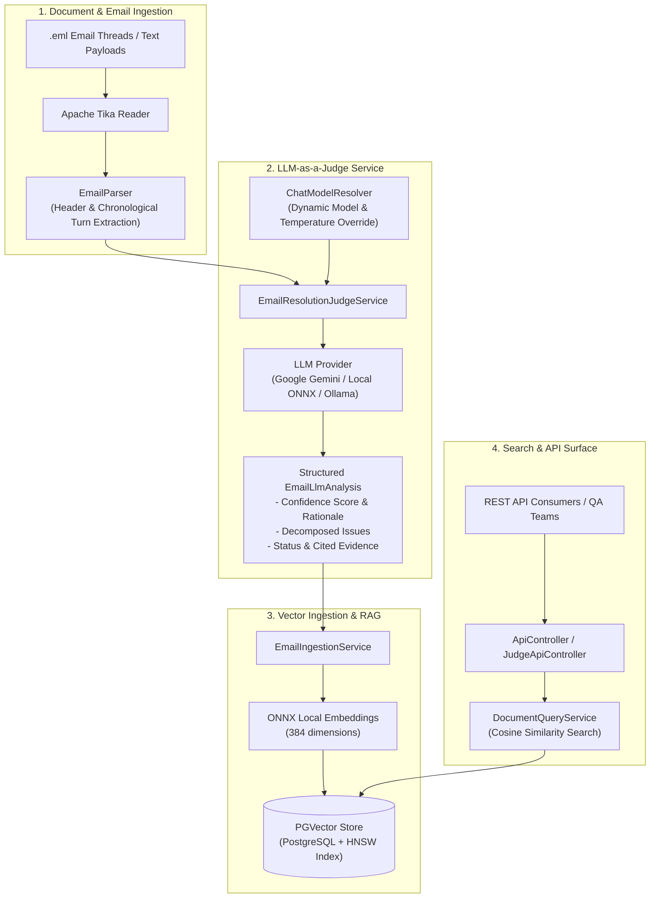

# Demo RAG & LLM-as-a-Judge Email Resolution Engine

[](https://openjdk.org/)
[](https://spring.io/projects/spring-boot)
[](https://spring.io/projects/spring-ai)
[](https://github.com/pgvector/pgvector)
[](https://onnxruntime.ai/)
[](https://swagger.io/)

A modern, production-grade Java service combining **Retrieval-Augmented Generation (RAG)** and an **LLM-as-a-Judge Evaluation Engine** to interpret, classify, and index complex multi-turn IT support and customer service email chains.

---

## 📌 Problem & Overview

Operations and support organizations process thousands of multi-turn email threads. Auditing whether customer issues are truly resolved, bypassed with temporary workarounds, or abandoned due to unresponsive participants is slow, error-prone, and unscalable when done manually.

This repository provides an automated, model-agnostic solution:
1. **LLM-as-a-Judge Resolution Engine**: Performs turn-by-turn chronological transcript analysis, decomposes threads into granular customer issues, and outputs strongly typed verdicts (`RESOLVED`, `WORKAROUND`, `UNRESOLVED`, `UNKNOWN`) backed by exact cited evidence and sentiment analysis.
2. **Semantic RAG Ingestion Pipeline**: Ingests email chains and arbitrary text, splits them into semantic chunks, generates vector embeddings using local ONNX transformer models, and indexes them into **PGVector** (PostgreSQL) with rich evaluation metadata for fast similarity retrieval.
3. **Pluggable Multi-Model Architecture**: Built on Spring AI 2.0 with dynamic model resolution, allowing seamless switching between cloud LLMs (Google Gemini, OpenAI, Claude) and local inference engines (Ollama).

---

## 🏗️ Architecture & Workflow



---

## ✨ Key Features

- **Granular Issue Decomposition**: Identifies each distinct problem within a single multi-turn email thread rather than treating the entire conversation as a monolithic ticket.
- **Strict Resolution Taxonomy**:
  - `RESOLVED`: Root cause diagnosed, permanent fix applied, customer confirmation verified.
  - `WORKAROUND`: Temporary mitigation, bypass, or rollback applied; underlying defect remains open.
  - `UNRESOLVED`: Issue failing, blocked on dependencies/permissions, or abandoned.
  - `UNKNOWN`: Insufficient or ambiguous context to classify.
- **Evidence & Chain-of-Thought Rationale**: Produces step-by-step reasoning alongside exact quoted sentences from conversation turns for full human auditability.
- **Local ONNX Embeddings**: Runs 384-dimensional embedding models locally using ONNX runtime without incurring external embedding API costs or latency.
- **Dynamic Model Resolution**: Runtime override of target LLM model name and temperature via `JudgeOptions` without service restart.
- **Comprehensive Benchmark Fixtures**: Includes over 300 ground-truth email chain fixtures (`dataset/*.eml`) spanning all resolution categories.

---

## 📊 Evaluation Output Schema

When an email thread is evaluated, the engine returns a structured `EmailLlmAnalysis`:

```json
{
  "confidenceScore": 0.95,
  "rationale": "Turn 1 reported VPN connection drops. Turn 2 suggested MTU configuration changes. Turn 3 confirmed successful connection with no further drops.",
  "issues": [
    {
      "status": "RESOLVED",
      "issue": "VPN connection drops after 15 minutes of idle time",
      "keyEvidence": [
        "Applying the MTU 1420 fix resolved all connection drops completely.",
        "Tested for 3 hours with stable connection."
      ],
      "rootCauseSummary": "Packet fragmentation due to default MTU size mismatch on gateway",
      "finalCustomerSentiment": "SATISFIED",
      "resolutionStepsTaken": "Updated client network adapter MTU setting to 1420."
    }
  ]
}
```

---

## 🚀 Getting Started

### Prerequisites

- **Java 26** JDK or newer
- **Maven 3.9+**
- **PostgreSQL** with the [`pgvector`](https://github.com/pgvector/pgvector) extension enabled (for vector store persistence)
- **Google Gemini API Key** (or another configured Spring AI provider)

### 1. Environment Configuration

Set your Gemini API key in your environment:

```bash
# Linux / macOS
export GEMINI_API_KEY="your-gemini-api-key"

# Windows (PowerShell)
$env:GEMINI_API_KEY="your-gemini-api-key"

# Windows (Command Prompt)
set GEMINI_API_KEY=your-gemini-api-key
```

### 2. Configure Database & Vector Store

Ensure PostgreSQL is running and update `src/main/resources/application.yml` if necessary:

```yaml
spring:
  ai:
    google:
      genai:
        api-key: ${GEMINI_API_KEY:}
        chat:
          options:
            model: gemini-3.5-flash
    embedding.transformer.enabled: true
    embedding.transformer.cache.directory: ./onnx-models
    vectorstore:
      pgvector:
        initialize-schema: true
        index-type: HNSW
        distance-type: COSINE_DISTANCE
        dimensions: 384
        table-name: vector_store
  datasource:
    url: jdbc:postgresql://localhost:5432/ragdb
    username: ${VECTOR_DB_USR:}
    password: ${VECTOR_DB_PWD:}
```

### 3. Build & Run the Application

```bash
# Compile and package
mvn clean package

# Run the Spring Boot application
mvn spring-boot:run
```

The application will start on `http://localhost:8080`.

---

## 📡 REST API Reference

Interactive Swagger documentation is available at `http://localhost:8080/swagger-ui.html` when the application is running.

### 1. Evaluate Email Chain (LLM-as-a-Judge)
Evaluates an uploaded `.eml` email chain and returns structured analysis without saving to vector database.

- **URL:** `POST /api/judge/evaluate-file`
- **Content-Type:** `multipart/form-data`
- **Parameters:**
  - `input` (File, required): The `.eml` email file.
  - `modelName` (Query param, optional): Specific LLM model identifier to use (e.g. `gemini-3.5-flash`).
  - `temperature` (Query param, optional): Sampling temperature (e.g. `0.0` for deterministic judge output).

```bash
curl -X POST "http://localhost:8080/api/judge/evaluate-file?temperature=0.0" \
  -F "input=@dataset/EMAIL_CHAIN_001_RESOLVED.eml"
```

### 2. Ingest Email into Vector Database
Evaluates an email chain and indexes each decomposed issue, root cause, and metadata into PGVector.

- **URL:** `POST /api/ingest-email`
- **Content-Type:** `multipart/form-data`
- **Parameters:** `input` (File, required): `.eml` email file.

```bash
curl -X POST "http://localhost:8080/api/ingest-email" \
  -F "input=@dataset/EMAIL_CHAIN_001_RESOLVED.eml"
```

### 3. Ingest Raw Text
Chunks and embeds arbitrary text documents into the vector store.

- **URL:** `POST /api/ingest-string`
- **Content-Type:** `application/json`
- **Body:**
```json
{
  "content": "Kubernetes pod evicted due to disk pressure on node worker-04.",
  "source": "incident-reports",
  "description": "Node storage alert",
  "topics": ["infrastructure", "kubernetes", "disk-pressure"]
}
```

```bash
curl -X POST "http://localhost:8080/api/ingest-string" \
  -H "Content-Type: application/json" \
  -d '{"content": "Kubernetes pod evicted due to disk pressure...", "source": "ops", "description": "Alert", "topics": ["k8s"]}'
```

### 4. Semantic Similarity Search (Ask)
Searches the vector store for documents matching the semantic meaning of the query.

- **URL:** `GET /api/ask?q={queryText}`

```bash
curl "http://localhost:8080/api/ask?q=VPN+connection+drops"
```

---

## 🧪 Testing & Verification

Run the test suite using Maven:

```bash
mvn test
```

Unit and slice tests run against an in-memory **H2 database** and mock configurations, ensuring zero external cloud dependencies during CI/CD test runs.

---

## 📁 Repository Structure

```
demo-ragapp/
├── dataset/                              # 300+ labeled .eml ground-truth email fixtures
│   ├── EMAIL_CHAIN_001_RESOLVED.eml
│   ├── EMAIL_CHAIN_002_WORKAROUND.eml
│   ├── EMAIL_CHAIN_008_UNRESOLVED.eml
│   ├── EMAIL_CHAIN_012_ABANDONED.eml
│   └── vector-database-snapshot.csv      # Ground truth benchmark reference
├── src/
│   ├── main/
│   │   ├── java/org/example/
│   │   │   ├── DemoApplication.java      # Spring Boot application entry point
│   │   │   ├── controller/
│   │   │   │   ├── ApiController.java        # Ingestion & similarity search endpoints
│   │   │   │   └── JudgeApiController.java   # LLM judge evaluation endpoint
│   │   │   ├── ingestion/
│   │   │   │   ├── EmailIngestionService.java   # Evaluates & indexes email issues
│   │   │   │   └── StringIngestionService.java  # Splits & indexes text snippets
│   │   │   ├── model/
│   │   │   │   ├── EmailLlmAnalysis.java        # Evaluation verdict record
│   │   │   │   ├── EmailLlmAnalysisIssue.java   # Decomposed issue record
│   │   │   │   ├── EmailMessage.java            # Parsed email message record
│   │   │   │   ├── EmailTurn.java               # Chronological turn representation
│   │   │   │   ├── IngestionReq.java            # Text ingestion DTO
│   │   │   │   └── JudgeOptions.java            # Dynamic model execution options
│   │   │   └── service/
│   │   │       ├── ChatModelResolver.java               # Pluggable model resolver interface
│   │   │       ├── DefaultChatModelResolver.java        # ChatClient & multi-model provider
│   │   │       ├── DocumentQueryService.java            # Vector store similarity search
│   │   │       ├── EmailParser.java                     # Email header & turn separator
│   │   │       ├── EmailResolutionJudgeService.java     # Judge interface
│   │   │       └── EmailResolutionJudgeServiceImpl.java # Prompt rubric & LLM evaluation
│   │   └── resources/
│   │       └── application.yml           # Database, PGVector, and Spring AI configuration
│   └── test/                             # Unit and integration test suites
├── SPEC.md                               # System specification & architectural decisions
├── pom.xml                               # Maven project dependencies and build plugins
└── README.md                             # Project overview and documentation
```

---

## 📄 License

This project is licensed under the Apache 2.0 License.
